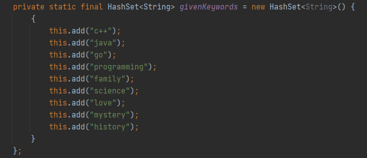
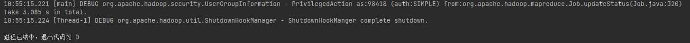
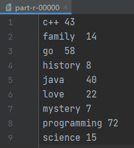

## Hadoop MapReduce

- 构造的图书简介位于**src/main/resources/data**文件夹内，分为四个文件，分别为CS.txt, Fiction.txt, Horror.txt 和Mystery.txt。

- 关键词列表没有单独存放在一个文件中，直接以静态形式存放在KeywordCount类中，具体数据如下所示：

  


具体实现过程详见代码及注释


### 参数设置

- 尝试修改***mapreduce.input.fileinputformat.split.maxsize***

  ```
  FileInputFormat.setMaxInputSplitSize(job, 20 * 1024L);
  ```

  修改这一参数的直接后果就是改变Mapper的数量，结果表明这样小量级的数据使用更多的mapper是不可取的，因为mapper的setup，中间文件的合并都有一定开销。而这一开销对于数据量小的应用场景而言是比较大的。

- 尝试修改***mapreduce.reduce.input.buffer.percent***

  该参数用于设定在内存中保存map输出的空间占堆空间的比例，reduce阶段开始时，内存中的map的输出大小不能大于这个值。

  由于数据量比较小，reduce端需要的内存很小，可以通过增加这个值来最小化访问磁盘的的次数，进而提高程序运行效率。


由于整体的数据量比较小，四个文件的大小均只有KB级别，所以MapReduce任务基本上一瞬间就做完了，使用**默认的参数**就会有很好的效果，对参数的调整对整体性能的提升并不明显，所以最后还是选择了默认的参数。


### 运行结果

程序正常退出：



运行时间在3s左右。

得到的结果输出文件在**src/main/resources/output**文件夹内，统计结果为：




### Mapper & Reducer数量

- Mapper: 由于数据量比较小，使用的是默认的参数，Hadoop会以默认的128MB的块大小进行split，而由于4个文本文件均不足128MB，所以会被分配到4个不同的Mapper上去，一个文件一个Mapper，故Mapper的数量为4。
- Reducer: 由于数据量比较小，关键词也不多，采用默认值1个。