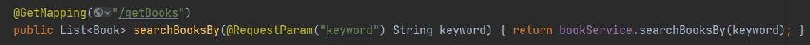
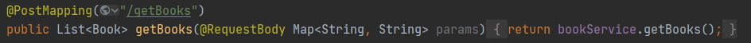

## 作业四：Searching & Web Service

### Searching

全文搜索使用的是Lucene

* 书籍简介存在/resources/bookInfo/bookInfo.txt文本中，以json格式存储，包括书籍介绍和书籍的BookId

* 先将文本文件解析成文档，并建立相应的**索引**，相关实现位于com.bookstore.lucene.Indexer中

* 建好的索引存在/resources/index中

* 然后使用索引进行**搜索**，相关实现位于com.bookstore.lucene.searcher中，内含一个可供测试的主函数

### Web Service

设计为Restful Web Service，相关实现在BookController中

@RestController表明server和client之间传输json对象

对同一个url，通过不同的方式请求，用get是获取全部书籍，用post是进行关键词全文搜索

restful有利于实现后端无状态服务，将状态信息存入传输的data里，从而实现数据驱动

但在全局搜索这项服务中，没有需要保存的状态信息，也就没有进行修改